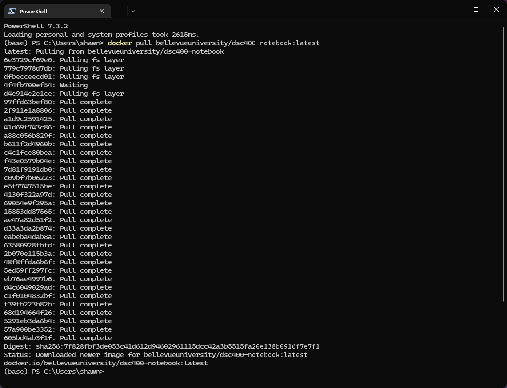
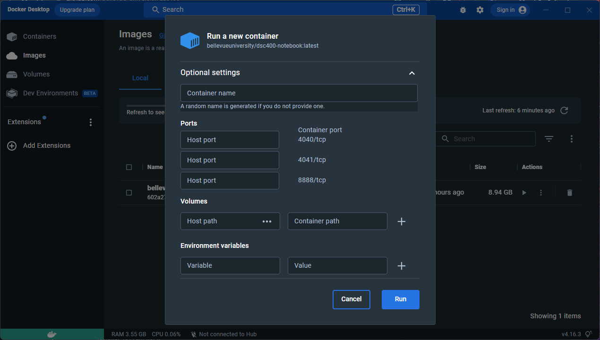
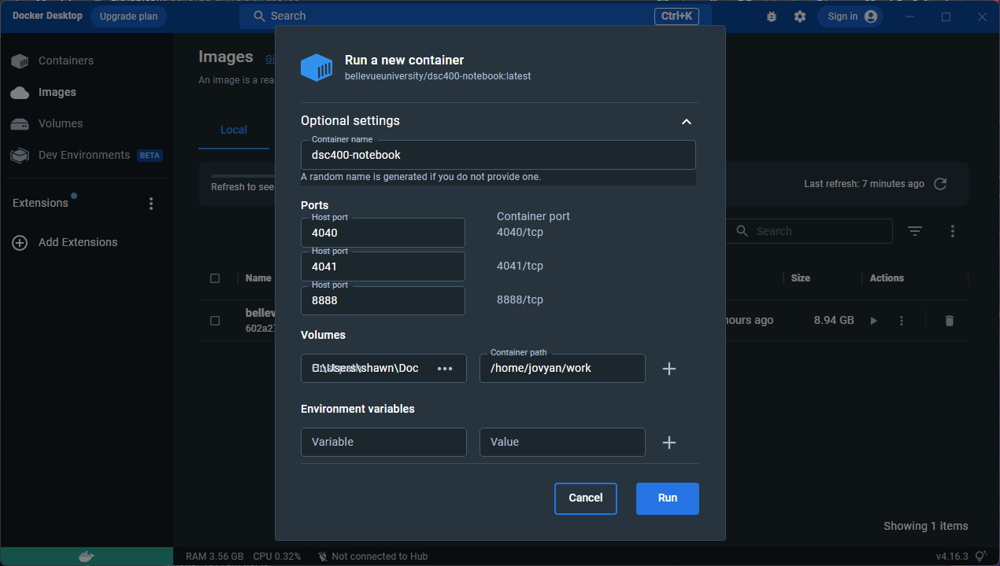

# DSC 400 - Big Data

## Description

With the cost of data storage consistently decreasing, data volumes are increasing and organizations are no longer forced to only store the bare minimum data. This course examines the technology required to analyze and process Big Data. Topics include: Hadoop/MapReduce, Spark/RDD, Spark/Storm Streaming, TensorFlow, Keras/Deep Learning, Kubernetes, and Docker. 

Prerequisite: DSC 360 Data Mining. Recommend: DSC 350 Data Wrangling for Data Science

## Running Docker Image

This repository provides a [custom Docker image](https://hub.docker.com/repository/docker/bellevueuniversity/dsc400-notebook/) derived from [Jupyter Docker Stacks](https://jupyter-docker-stacks.readthedocs.io/en/latest/). 

Download and install [Docker Desktop](https://www.docker.com/products/docker-desktop/) for your computer. Once you have finished installing Docker Desktop, open the terminal for your operating system (e.g. Powershell if you are using Windows) and pull the latest notebook image using the following command.

```shell
docker pull bellevueuniversity/dsc400-notebook:latest
```

NOTE: Powershell or Windows-Subsystem for Linux is recommended if you are running on Windows. 



Now that you have pulled the image, you can run the image as a container using the Docker Desktop application. Start by navigating to the *Images* section. 


Click on the *run* button. You will be prompted to enter settings to run the container.



Enter the appropriate settings. For example, it is recommended that you map `/home/jovyan/work` to the directory on your local machine that contains the DSC 400 materials.



Finally, You can access the notebook by navigating your browser to `http://127.0.0.1:8888/lab?token=<TOKEN>`. You can find the full URL with the token value in the container's log output.


