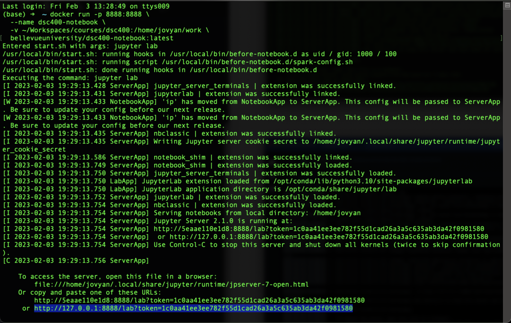
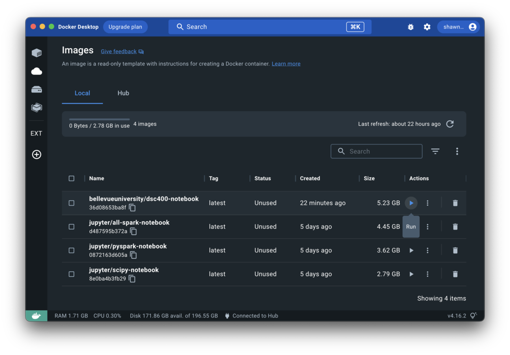
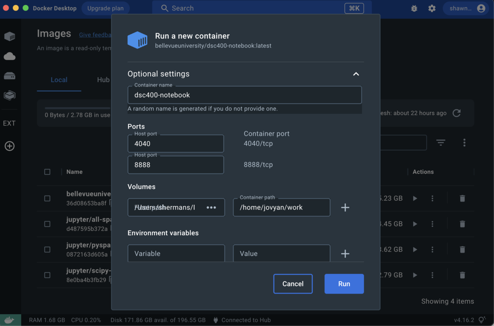
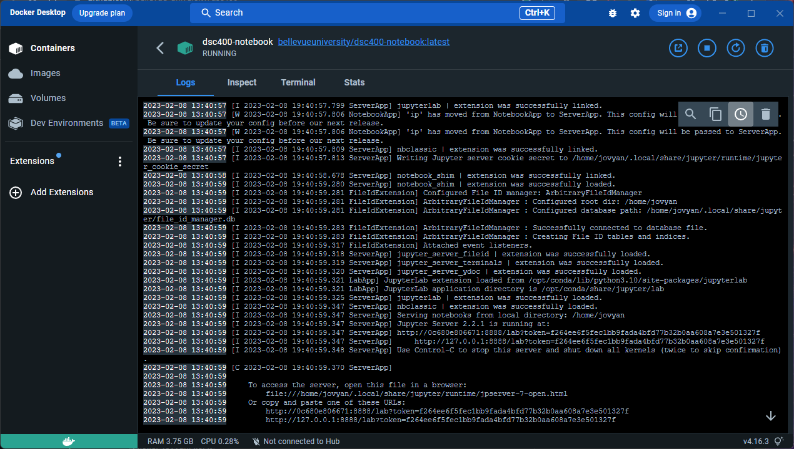

# DSC 400 - Big Data

## Description

With the cost of data storage consistently decreasing, data volumes are increasing and organizations are no longer forced to only store the bare minimum data. This course examines the technology required to analyze and process Big Data. Topics include: Hadoop/MapReduce, Spark/RDD, Spark/Storm Streaming, TensorFlow, Keras/Deep Learning, Kubernetes, and Docker. 

Prerequisite: DSC 360 Data Mining. Recommend: DSC 350 Data Wrangling for Data Science

## Running Docker Image

This repository provides a [custom Docker image](https://hub.docker.com/repository/docker/bellevueuniversity/dsc400-notebook/) derived from [Jupyter Docker Stacks](https://jupyter-docker-stacks.readthedocs.io/en/latest/). 

Download and install [Docker Desktop](https://www.docker.com/products/docker-desktop/) for your computer. Once you have finished installing Docker Desktop, open the terminal for your operating system (e.g. Powershell if you are using Windows) and pull the latest notebook image using the following command.

```shell
docker pull bellevueuniversity/dsc400-notebook:latest
```

You can run the image as a container using the following command: 

```shell
docker run -p 8888:8888 \
  --name dsc400-notebook \
  -v /some/host/folder/for/work:/home/jovyan/work \
  bellevueuniversity/dsc400-notebook:latest
```

The `-p 8888:8888` option maps the container port 8888 to port 8888 on the host. The option `-v /some/host/folder/for/work:/home/jovyan/work` makes the host folder `/some/host/folder/for/work` available in the running container at `/home/jovyan/work`. 

You can access the notebook by navigating your browser to `http://127.0.0.1:8888/lab?token=<TOKEN>`. You can find the full URL with the token value in the container's log output. 



Additionally, you can run and manage the container in the Docker Desktop application. Start by opening the Docker Desktop application and navigating to images. Find the `bellevueuniversity/dsc400-notebook:latest` image and click the *Run* button.



When prompted, enter the optional settings, including port and volume mappings. 



Finally, you can find the notebook URL and authentication token by navigating to the running container's log file. 




